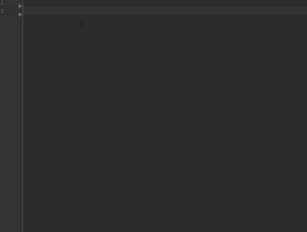

# Flutter Snippet for Android Studio
This extension contains code snippets for Flutter and is based on the Live template Android Studio

## Installation
Download [flutter-snippet.jar](https://github.com/benznest/flutter-snippet/raw/master/flutter-snippet.jar)

Android Studio > File > Import Settings 

  

## Flutter Snippets

Below is a list of all available snippets and the triggers of each one. 

| Trigger                             | Content |
| -------:                            | ------- |
| `flt animation→`                    | StatefulWidget and Animation Controller |
| `flt btn raise→`                    | Raised button widget and Text child |
| `flt build→`                        | Build widget method |
| `flt card→`                         | Basic card widget |
| `flt center→`                       | Center widget |
| `flt column→`                       | Column widget |
| `flt container radius→`             | Container and Radius border |
| `flt import cupertino→`             | Add importing cupertino library |
| `flt cupert segment control→`       | Custom Segmented Control |
| `flt cupert show datetime dialog→`  | Show Cupertino datetime dialog |
| `flt duw→`                          | didUpdateWidget function |
| `flt dispose→`                      | dispose function |
| `flt drawer→`                       | Drawer widget |
| `flt expand→`                       | Expanded widget |
| `flt form validate→`                | Basic form validation |
| `flt gesture→`                      | Gesture Detector Widget |
| `flt gridview builder→`             | Custom Gridview with Builder |
| `flt icon→`                         | Icon widget |
| `flt img asset→`                    | Image Asset widget |
| `flt img url→`                      | Load image from URL |
| `flt init→`                         | initState function |
| `flt listview→`                     | Basic Listview |
| `flt listview builder→`             | Custom Listview with Builder |
| `flt import material→`              | Add importing material library |
| `flt material route→`               | Material route |
| `flt model→`                        | Custom Model class and json converter |
| `flt navigate pop→`                 | Pop page function |
| `flt navigate push→`                | Push page function |
| `flt newinstance→`                  | newIntance function |
| `flt orientation→`                  | Check Orientation |
| `flt padding→`                      | Padding widget |
| `flt row→`                          | Row widget |
| `flt setstate→`                     | setState function |
| `flt show dialog→`                  | showDialog function |
| `flt snackbar→`                     | Snack Bar widget |
| `flt stful→`                        | StatefulWidget and build function |
| `flt stful anim→`                   | StatefulWidget and Animation Controller |
| `flt stful run app→`                | StatefulWidget MaterialApp runApp and Simple Scaffold |
| `flt stful scff floating→`          | StatefulWidget Simple Scaffold and Floating button |
| `flt stless→`                       | Basic StatelessWidget |
| `flt text→`                         | Text widget |
| `flt text style→`                   | TextStyle widget |
| `flt theme data→`                   | ThemeData and color |
| `flt timer→`                        | Timer widget |
  
## HTTP Library Flutter Snippets

Below is a list of [HTTP](https://pub.dartlang.org/packages/http) library snippets and the triggers of each one. 

| Trigger                             | Content |
| -------:                            | ------- |
| `flt import redux→`                 | Add importing redux library |
| `flt redux app full→`               | Simple Redux App |
| `flt redux connector→`              | Connector redux widget|
| `flt redux store→`                  | Store variable |
| `flt redux store provider→`         | StoreProvider widget |
  
## Shared Preference Library Flutter Snippets

Below is a list of [Shared Preference](https://pub.dartlang.org/packages/shared_preferences) library snippets and the triggers of each one. 

| Trigger                             | Content |
| -------:                            | ------- |
| `flt import sharepref→`             | Add importing Shared Preference library |
| `flt sharepref get→`                | Get data from Shared Preference |
| `flt sharepref set→`                | Set data to Shared Preference|

